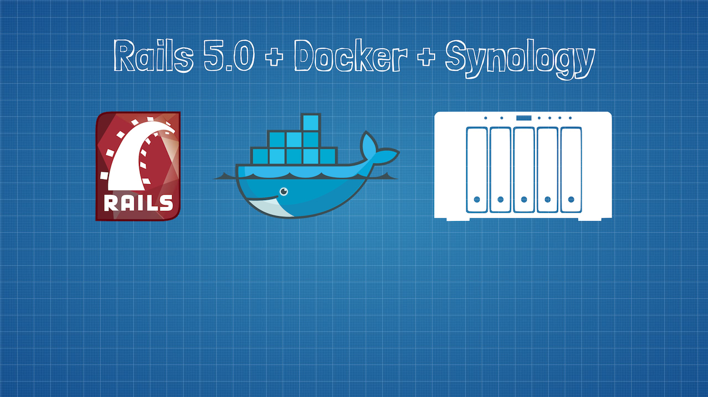
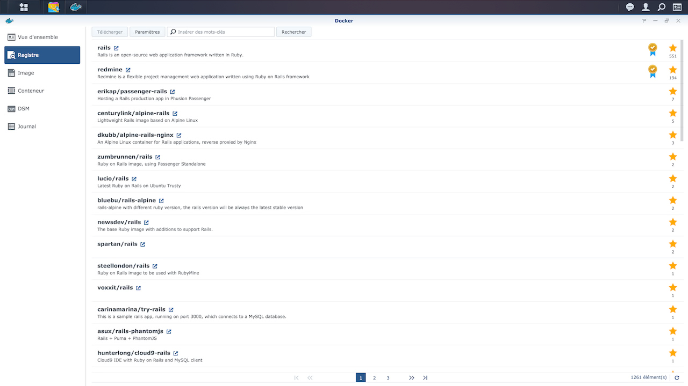
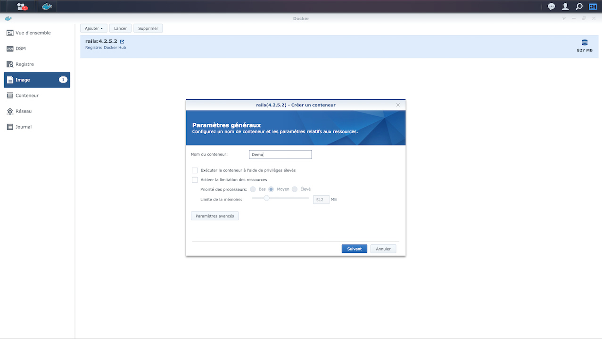
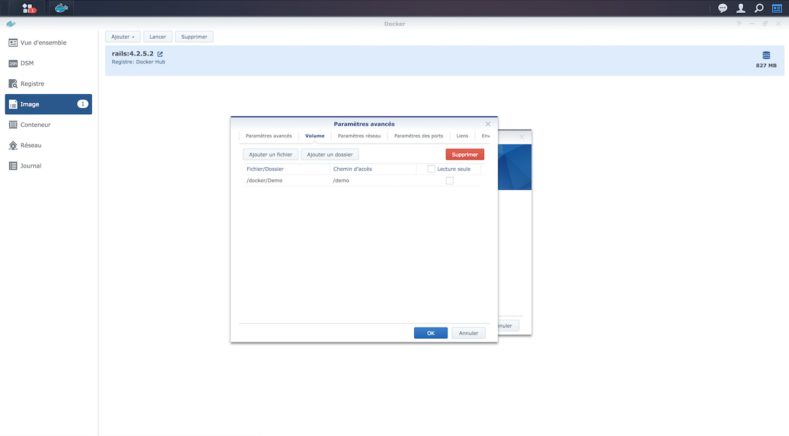
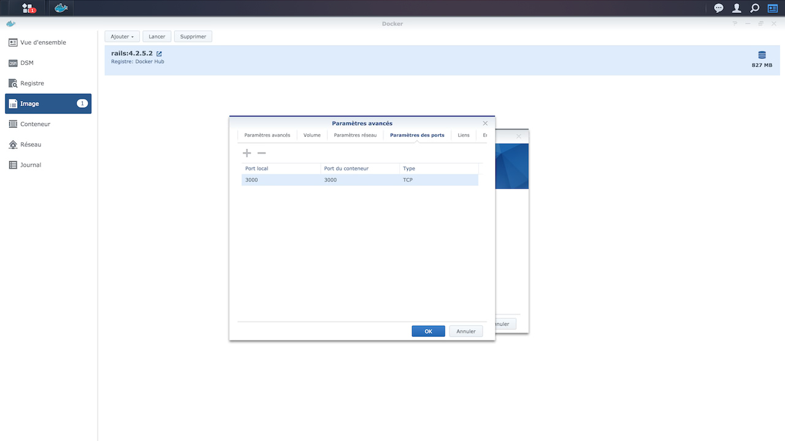
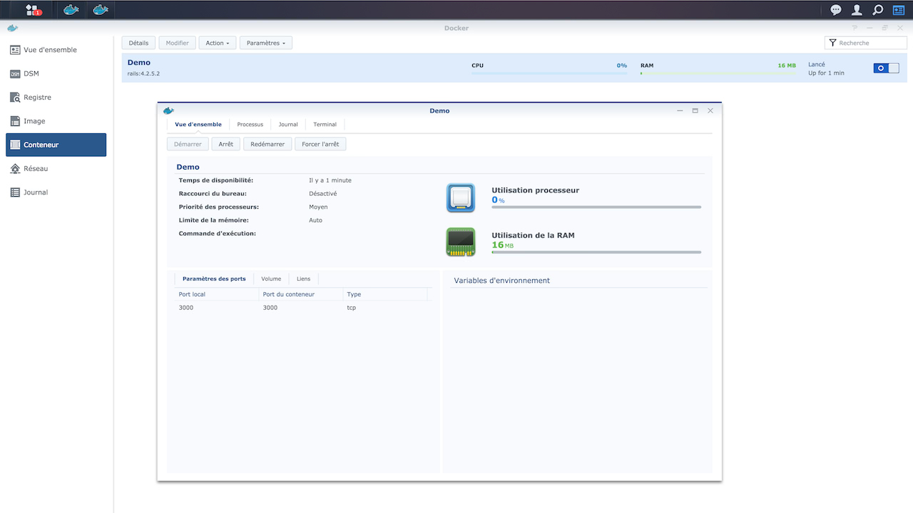
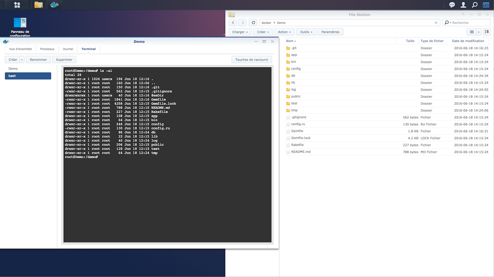

On a vu dans un [article précédent](/ruby-on-rails-installation-sur-un-raspberry-pi-3) comment installer et lancer Ruby On Rails sur un Raspberry Pi 3\. Aujourd'hui, on va cette fois-ci voir comment le faire avec Docker et un NAS Synology. Avant toute chose, vérifiez bien que votre NAS est compatible avec le [package Docker ici](https://www.synology.com/en-us/dsm/app_packages/Docker).

Maintenant qu'on est bon sur ça, on va pouvoir télécharger Docker dans le centre des paquets, il est directement fourni par Synology.

Ouvrez l'application et dans l'onglet "Registre", vous pouvez alors rechercher une image directement depuis le Hub Docker. Dans notre cas, on a besoin de Rails et je vais prendre l'image officielle pour l'exemple. Sachez que vous avez un petit raccourci vers la page de l'image directement avec la flèche dans le carré bleu à côté des titres, plutôt pratique. Notez que le registre vous permet de télécharger des images sans passer par l'interface sur [https://hub.docker.com/](https://hub.docker.com/), mais que vous pouvez toujours le faire et télécharger une image depuis un lien et l'onglet "image".



Lancez le téléchargement de Rails et nous avons alors le choix de la version, à l'heure où j'écris ces lignes, Rails 5 est toujours en release candidate, il faudra donc aller chercher la version "latest" ou dans mon cas "4.2.5.2". Ce conteneur vient donc avec la version indiquée de Rails mais rien ne nous empêchera de la mettre à jour par la suite (ce que nous allons faire d'ailleurs) !

Le téléchargement peut alors prendre un certain temps en fonction de votre connexion car l'image fait presque 800MB.

Une fois le téléchargement terminé, nous allons pouvoir créer notre conteneur en cliquant sur "Lancer". Un assistant va alors nous proposer un certain nombre de paramètres pour configurer notre conteneur.

On nous invite alors à choisir un nom et à choisir si l'on veut élever les privilèges ou limiter les ressources, ce qui peut être pratique si votre NAS n'est pas très performant et que vous ne voulez pas ralentir votre système pour d'autres applications à côté.



Nous allons devoir faire quelques réglages dans les paramètres avancés avant de continuer. La première étape n'est pas obligatoire mais assez utile je trouve, elle va permettre de lier un dossier sur votre NAS directement à un dossier dans votre conteneur. Choisissez alors un dossier sur votre NAS et un nom de dossier sur votre conteneur et toutes les modifications seront répercutées aux deux endroits.



Une autre étape importante, c'est le paramètre des ports. En effet, pour pouvoir accéder à notre conteneur depuis l'extérieur il faudra passer par un port, je vais prendre le port 3000 par défaut, mais vous pouvez prendre celui de votre choix tant qu'il est disponible.



Un résumé de la configuration est alors affiché pour vérifier que tout est correct.


Dans l'onglet "conteneur", vous devriez voir votre nouveau conteneur que vous pouvez lancer directement avec le petit switch à droite. En cliquant sur l'onglet "détails", nous avons accès à un récapitulatif de notre conteneur et des ressources qu'il utilise.



L'onglet qui va nous intéresser, c'est celui du terminal. Un fois dedans, créez un nouveau terminal bash. Vous pouvez alors vérifier que Rails et Ruby sont bien disponible, mais pour ma part je vais faire la mise à jour vers la version 5.0.0.rc1 qui est la dernière actuellement :
```bash
$ gem install rails --pre
```

Vous pouvez en profiter pour mettre votre conteneur à jour, c'est toujours mieux.

Et maintenant, il ne vous reste plus qu'à placer le code de votre application dans un dossier. Si vous avez activé le partage de dossier précédemment, vous pouvez glisser directement votre application dans ce dossier et vous y rendre depuis le terminal.



Une fois les dépendances installées et les migrations effectuées, nous allons pouvoir lancer notre serveur. Pour rappel, j'avais choisi de le faire sur le port 3000, mais adaptez selon vos besoin :
```bash
$ rails s -p 3000 -b 0.0.0.0
```

Il faut bien binder l'adresse 0.0.0.0 du conteneur pour y avoir accès depuis l'extérieur.

Et voilà, votre serveur en marche, vous pouvez y accéder depuis l'ip de votre NAS avec le port que vous lui avez spécifié. Même remarque que pour le Raspberry Pi, si vous avez configuré votre NAT/PAT vous pourrez y accéder depuis n'importe où.


Si vous avez besoin d'explications supplémentaires où que vous avez besoin de corriger une partie, n'hésitez pas à m'en faire part dans les commentaires !

À bientôt !
