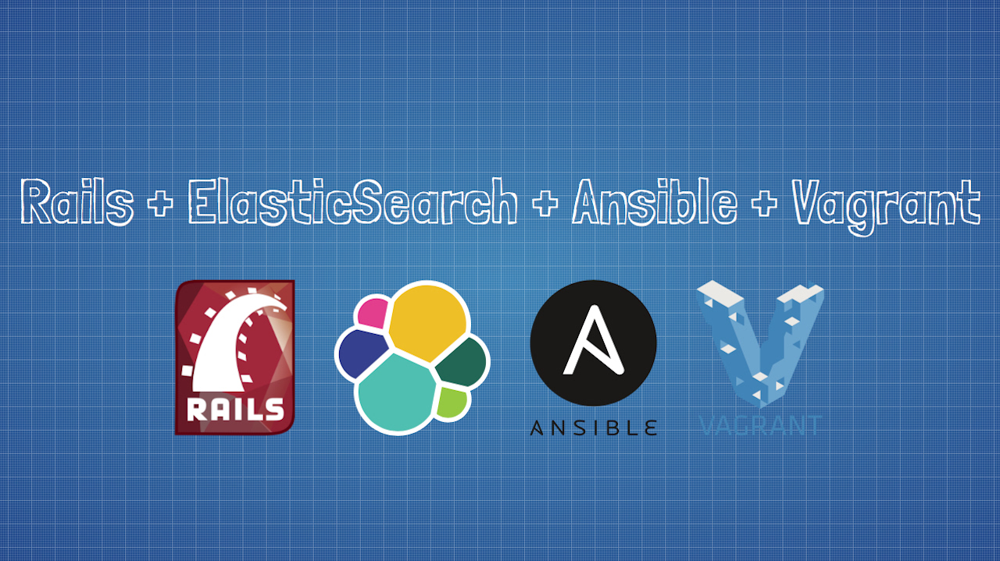
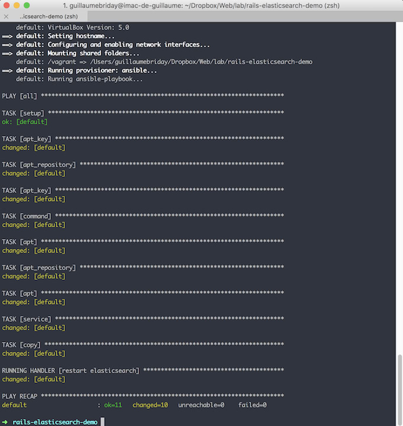
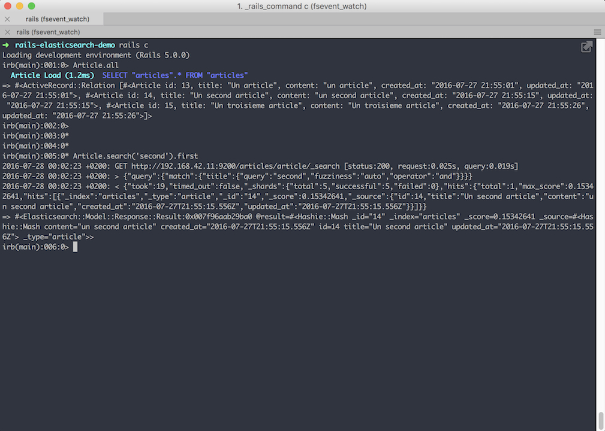
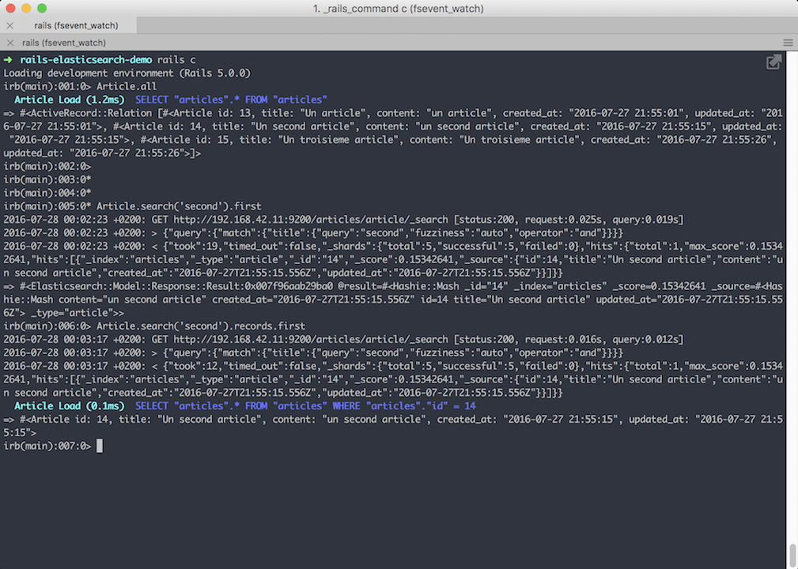
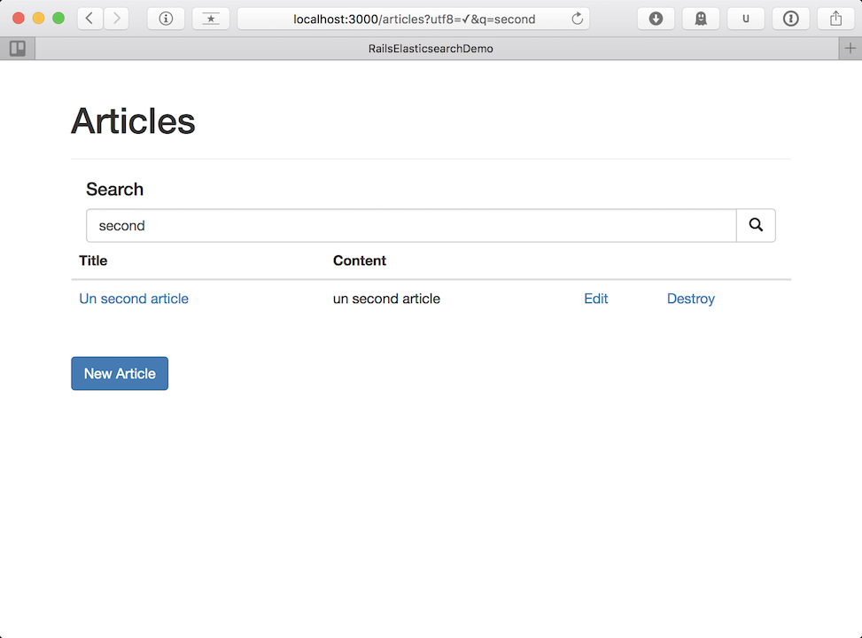

Aujourd'hui nous allons voir plusieurs notions de mise en place serveur avec un exemple concret : Utiliser [ElasticSearch](https://www.elastic.co/guide/index.html) avec Ruby On Rails. Je ne vais pas montrer comment fonctionne ElasticSearch (ES) mais comment l'installer sur une machine virtuelle avec Vagrant et Ansible pour s'en servir sur une application Rails.

## Présentation

Pour ce projet, je ne vais pas faire compliquer, un [CRUD](https://fr.wikipedia.org/wiki/CRUD) classique qui va gérer des articles.

```bash
$ rails g scaffold Article title:string content:text
```

On va pouvoir ajouter nos Gems nécessaires pour communiquer avec ES :

```ruby
# Gemfile
gem 'elasticsearch-model'
gem 'elasticsearch-rails'
```

J'en profite au passage pour ajouter Bootstrap pour avoir rapidement une présentation un peu plus sympa à l'oeil.

Un coup de :

```bash
$ bundle install
$ rails db:migrate
```

## Partie Rails

### Configuration

Nous allons commencer par faire ce qu'il faut sur Rails pour finir sur la partie machine virtuelle.

Il va falloir ajouter une configuration pour changer l'adresse du serveur ES, par défaut c'est `127.0.0.1:9200`, or nous ne voulons pas que ES soit sur le même serveur, il faut donc modifier `l'host` :

```ruby
# config/initializers/elasticsearch.rb
Elasticsearch::Model.client = Elasticsearch::Client.new host: ('192.168.42.11'),
                                                        port: 9200,
                                                        log: true
```

Désormais, les requêtes seront effectuées à l'adresse définie. Bien entendu, vous pouvez prendre le serveur que vous souhaitez ou dans notre cas choisir l'adresse ip de votre choix..

### Models

Nous allons devoir modifier quelque peu notre model `Article`. Pour être [DRY](https://en.wikipedia.org/wiki/Don%27t_repeat_yourself) et prévoir les futurs models sur lesquels on voudra pouvoir effectuer des recherches, nous allons utiliser les `concerns`. Si vous n'êtes pas à l'aise avec le principe des `concerns`, je vous invite à checker la [documentation](https://api.rubyonrails.org/classes/ActiveSupport/Concern.html).

On va créer un Module `Searchable` :

```ruby
# app/models/concerns/searchable.rb
module Searchable
  extend ActiveSupport::Concern
```

Et dans notre model `Article`, on inclut le module `Searchable` :

```ruby
# app/models/article.rb
class Article < ActiveRecord::Base
  include Searchable
```

### Controllers

Nous avons maintenant accès aux méthodes proposées par le model `Elasticsearch` comme la méthode `search`:

```ruby
# app/controllers/articles_controller.rb
class ArticlesController < ApplicationController
  # GET /articles
  # GET /articles.json
  def index
    @articles = Article.all
    if params[:q].present?
      @articles = Article.search params[:q]
    end
  end
  # Reste du controller...
```

On pourrait s'arrêter ici pour la partie Rails mais on va rajouter un peu de personnalisation.

De retour dans le concern `Searchable`, nous allons surcharger la méthode search de cette manière par exemple :

```ruby
# app/models/concerns/searchable.rb
  included do
    include Elasticsearch::Model
    include Elasticsearch::Model::Callbacks # automatically update the index whenever the record changes
```

On pourra redéfinir dans chaque model cette méthode ou en écrire de nouvelles pour être spécifique à chaque ressources. Si vous n'êtes pas à l'aise avec la syntaxe d'ElasticSearch, je vous redirige vers la [documentation](https://www.elastic.co/guide/en/elasticsearch/reference/current/getting-started.html) pour cela.

## Partie VM

Bien maintenant que la partie Rails est terminée, nous allons pouvoir préparer la machine virtuelle.

Pour rappeler ce que j'ai dit en introduction, nous allons utiliser deux outils, Vagrant et Ansible. Vous devez donc d'abord installer ces outils sur votre système ainsi que [Virtualbox](https://www.virtualbox.org).

Vagrant va permettre de communiquer avec VirtualBox pour monter facilement une machine virtuelle avec la configuration de notre choix. à la racine de votre projet, créez un fichier `Vagrantfile`, il sera appelé lors de la commande `vagrant up`. N'oubliez pas de choisir la même adresse ip que l'on a mis dans la configuration de Rails juste avant.

```ruby
# Vagrantfile
# -*- mode: ruby -*-
# vi: set ft=ruby :
Vagrant.configure(2) do |config|
  config.vm.hostname = 'demo.dev'
  config.vm.box = 'ubuntu/trusty64'
  config.vm.network 'private_network', ip: '192.168.42.11'
  # Run Ansible from the Vagrant Host
  config.vm.provision 'ansible' do |ansible|
    ansible.playbook = 'provisioning/dev/playbook.yml'
    ansible.sudo = true
  end
```

Nous pouvons choisir le `hostname` de la machine virtuelle, l'image que nous allons utiliser, `ubuntu/trusty64` dans notre cas et l'adresse ip de notre choix. Il va télécharger l'image sur votre système et donc le faire qu'une seule fois, ce qui peut être long au premier lancement.

Une fois que la machine virtuelle sera montée et lancée, elle lancera le `playbook.yml` d'Ansible, voyons cela plus en détail :

```yaml
# provisioning/dev/playbook.yml
---
- hosts: all
  tasks:
  # Install and configure Elasticsearch
  - apt_key: keyserver=keyserver.ubuntu.com id=EEA14886
  - apt_repository: repo='deb http://ppa.launchpad.net/webupd8team/java/ubuntu trusty main' update_cache=yes
  - apt_key: url="https://packages.elastic.co/GPG-KEY-elasticsearch" id="D88E42B4"
  - shell: echo oracle-java8-installer shared/accepted-oracle-license-v1-1 select true | /usr/bin/debconf-set-selections
  - apt: name=oracle-java8-installer
  - apt_repository: repo="deb http://packages.elastic.co/elasticsearch/2.x/debian stable main" update_cache=yes
  - apt: name=elasticsearch state=present
  - service: name=elasticsearch state=started enabled=yes
  # Changing the default configuration
  - copy: src=elasticsearch.yml dest=/etc/elasticsearch/elasticsearch.yml
    notify: restart elasticsearch
```

Ansible nous permet de provisionner notre VM automatiquement en exécutant pour nous des commandes.

N'oubliez pas de versionner ces fichiers, n'importe quel développeur pourra avoir le même environnement de développement que vous par la suite.

On peut alors lancer vagrant avec :

```bash
$ vagrant up
```

Si tout s'est déroulé correctement, vous devriez avoir quelque chose qui ressemble à ça :



La machine virtuelle se lance en tâche de fond, rien ne s'ouvre ou ne bloque l'invite de commande. Vous pouvez voir le statut de vos box :

```bash
$ vagrant status # current box
$ vagrant global-status # all boxes for this user
Current machine states:
```

Vous pouvez mettre en pause votre machine virtuelle :

```bash
$ vagrant halt
```

ou relancer le provisionnement avec Ansible :

```bash
$ vagrant provision
```

Pour voir si tout fonctionne bien, on peut vérifier si ES répond correctement avec curl :

```bash
$ curl -I 192.168.42.11:9200
HTTP/1.1 200 OK
```

## Les deux ensembles

On peut maintenant lancer une rechercher sur Rails non ?! Et bien... pas encore. Une erreur de type `index_not_found_exception` est lancée. En effet, ES a besoin de générer un index à partir des models, donc dans la console rails :

```ruby
$ Article.__elasticsearch__.create_index! force: true
$ Article.import
$ Article.__elasticsearch__.refresh_index!
```

Et cela pour chaque model pour lequel on souhaitera utiliser ElasticSearch...

Attention toutefois, ES renvoie un objet `Elasticsearch` et pas `Article` comme on pourrait s'y attendre, il renvoie simplement les informations de son index. Si vous souhaitez forcer le chargement depuis la base de données, vous pouvez utiliser les `records`, ES fera alors un `where in (:ids)` et vous aurez des `Article` dans notre cas.





Utiliser la méthode `records` permettra, comme n'importe quelle `ActiveRecord::Relation`, d'être chainable pour modifier la requête :

```ruby
$ Article.search('second').records.order(title: :desc)
```

## Conclusion

Ta-da ! Nous avons une recherche fonctionnelle ! Je vous publie l'ensemble de l'application sur [ce dépôt Github](https://github.com/guillaumebriday/Rails-elasticsearch-vagrant-ansible-demo), n'hésitez pas à le corriger ou le commenter.




Merci !
