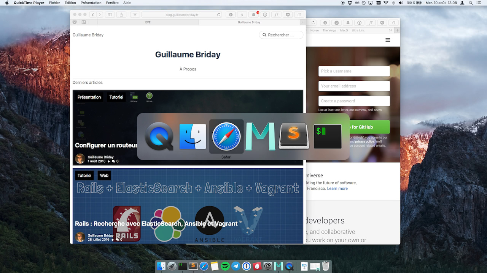
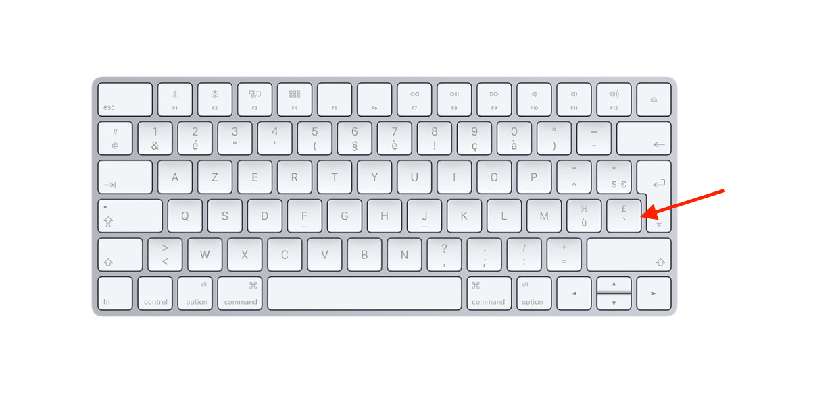

Aujourd'hui, une petite astuce qui ne paye pas de mine mais qui peut s'avérer très pratique au quotidien.

Si, comme moi, vous venez du monde des fenêtres (Windows), vous avez pu êre déstabilisé en arrivant sur OS X et ne voir dans le menu <kbd>alt tab</kbd> qu'une seule icône par application même si plusieurs fenêtres étaient ouvertes. Il est donc impossible avec cette méthode de switcher rapidement au clavier entre différentes fenêtres de Safari par exemple.

Malgré tout, il existe un raccourci pour passer d'une fenêtre à l'autre sans avoir à lever sa main jusqu'à la souris !

Rendez vous dans `Préférences > Clavier > Raccourcis > Clavier` et vous pourrez voir la ligne : `Déplacer la cible sur la fenêtre suivante` avec le raccourci <kbd>⌘`</kbd>.

Cela fait sens pour les claviers US car la touche <kbd>`</kbd> est juste au dessus de <kbd>tab</kbd> mais ce n'est pas le cas pour nous et le raccourci en devient inutile...

Il vous suffit alors, dans les préférences toujours, de changer le raccourci pour <kbd>⌘@</kbd> et on retrouve alors le comportement qu'Apple avait prévu pour les US.

Si maintenant vous ouvrez plusieurs fenêtres d'une application, vous pourrez les faire défiler rapidement avec ce petit raccourci.

J'espère avoir pu vous aider !

Merci !
