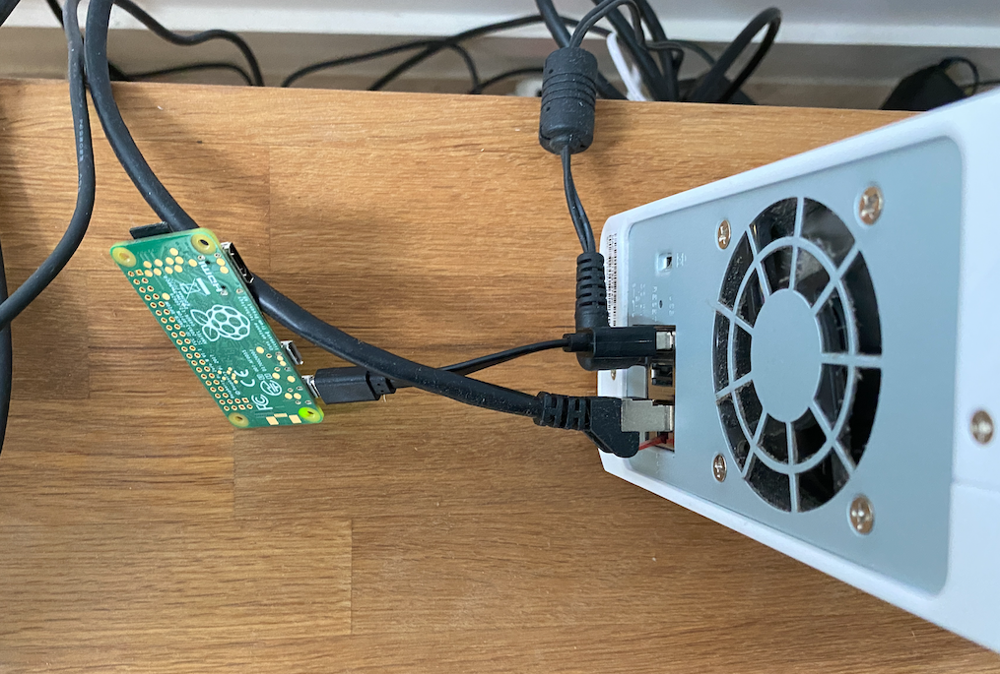

## Introduction

If you want to install [Pi-hole](https://pi-hole.net/) on your network, you might be interested in using a Raspberry PI. It's cheap and easy to set up. If you already have a device that can host Pi-hole maybe you don't this at all.

In this post, we will go through all the steps to install Pi-hole on a Raspberry PI Zero W from scratch.

The Raspberry PI Zero W is one of the cheapest Raspberry, it's not powerful, but it's far enough for our needs and the `W` stands for Wireless, which means we can use WiFi with it, no more ethernet adapter needed, how cool is that?

The power consumption is ridiculous, I can use my NAS' USB port.



## Requirements

Because the setup will be headless, we don't need anything more than the Pi itself, its Micro SD Card and an micro USB cable for power.

- [Raspberry PI Zero W](https://www.kubii.fr/les-cartes-raspberry-pi/1851-raspberry-pi-zero-w-kubii-3272496006997.html) - 10€
- [Micro SD card](https://www.kubii.fr/raspberry-pi-microbit/2587-carte-micro-sd-sandisk-16go-classe10-taux-de-transfert-80mb-kubii-619659161354.html) - 10€

## 1. Install Raspbian

We need to install Raspbian, the default and official Operating System for Raspberry.

Open [https://www.raspberrypi.org/software/operating-systems/](https://www.raspberrypi.org/software/operating-systems/) and download the `Raspberry Pi OS Lite` image, we don't need all the fancy stuff like desktop.

On macOS, you can use [Etcher](https://github.com/balena-io/etcher) to flash your image.

```bash
$ brew install balenaetcher
```

Open it and select the `.zip` file of the Raspbian image you have just downloaded.

Select the SD card and click on `Flash!`.

You're done! But we still are more few things to do before running it because of the headless environment.

## 2. Configure SSH

We will need SSH to connect it over the WiFi. It's disabled by default for security reasons.

To enable it, we simply need to create an empty file called `ssh` (without extension) at the root of the SD Card.

See: [Official documentation](https://www.raspberrypi.org/documentation/remote-access/ssh/README.md).

## 3. Configure WiFi

Also because of the headless environment, we need to configure WiFi before booting the Raspberry Pi.

Create a file at the root of the SD Card called `wpa_supplicant.conf` and past this in:

```ini
ctrl_interface=DIR=/var/run/wpa_supplicant GROUP=netdev
country=<Insert 2 letter ISO 3166-1 country code here>
update_config=1

network={
  ssid="<Name of your wireless LAN>"
  psk="<Password for your wireless LAN>"
}
```

Don't forget to update the `country` code, for instance `FR`, `GB` or `US`. And change define the `ssid` and the `psk` (password) of your wireless Network.

**Be careful, it only works with 2.4GHz, not 5GHz.**

See: [Official documentation](https://www.raspberrypi.org/documentation/configuration/wireless/headless.md).

You can now eject the SD Card, and boot your Raspberry PI up.

## 4. Connect to the Raspberry PI

If everything went well, you should be able the find the Raspberry PI on your network.

**Open your router settings and assign a `static IP address` in the DHCP options for the Raspberry PI because we will use it in our DNS settings.**

## 5. Upgrade your system

```bash
$ sudo apt update
$ sudo apt upgrade
```

## 6. Install Pi-hole

To install Pi-Hole, run this command:
```bash
$ curl -sSL https://install.pi-hole.net | bash
```

To change the dashboard password from command line:
```bash
$ pihole -a -p
```

Find the dashboard at this address: `http://<rpi-ip-address>/admin/`

See: [Official documentation](https://docs.pi-hole.net/main/basic-install/).

## 7. Change your DNS settings

There are two possibilities.

You can change it in your router settings, so every devices on the network will use Pi-hole.

Or you can change it per device.

For instance, on macOS, open the System Preferences -> Network -> Advanced -> DNS, and **keep only the IP address** of your Raspberry PI:


## Conclusion

You can now enjoy ad free Web or mobile App experience!
